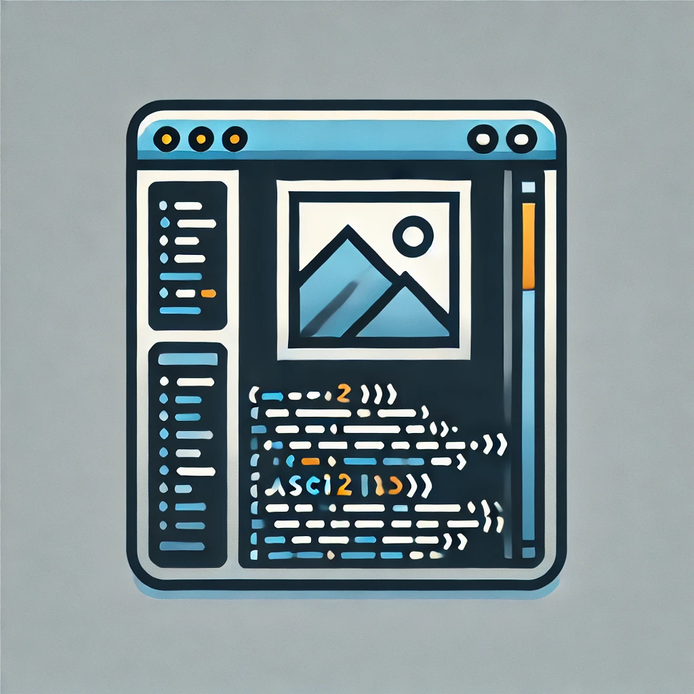

<div align="center">
  
</div>

<br>

<div align="center">

  [](https://github.com/marsdevx/ascii2header/commits/main "Last Commit")
  [](https://github.com/marsdevx/ascii2header "Shell Support")
  <br>
  [](https://github.com/marsdevx/ascii2header "Languages")
  [](https://github.com/marsdevx/ascii2header "Header Generator")
  [](https://github.com/marsdevx/ascii2header "Customizable")
  [](https://github.com/marsdevx/ascii2header/blob/main/LICENSE "License")

</div>

---

# 🖌️ ASCII to Header

This project is a **command-line** tool designed to add customizable **headers** to your **code** files with **ASCII art** and **file information**. Built with **Python**, this lightweight and **open-source** program makes it easy to **personalize** your files and add a **professional touch**.

*	Custom **ASCII** art to make **your headers** visually unique.
*	Automatically adds **file-specific** **metadata**.
*	Built with **Python** for simplicity and **cross-platform** compatibility.
*	A great tool for **developers** who want to enhance the **readability** and branding of their **code files**.

Add style and structure to your code with this powerful and flexible header generator!

---

## 🖼️ Preview

<div align="center">
  
</div>

---

## 🛠️ Installation

To install this project, Launch the Terminal app on your system, and run the commands below. <br>
  - If a pop-up appears prompting you to download the Xcode Command Line Tools after the first command, click “Download” and then run the first command again.

1. **Clone repo**
```bash
git clone https://github.com/marsdevx/ascii2header.git ~/ascii2header
```

2. **Install Python**
```bash
brew install python
```

3. **Set Up an Alias**

- For Zsh Users
```bash
echo "\nalias ascii2header=\"python3 /Users/$(whoami)/ascii2header/ascii2header.py\"" >> ~/.zshrc
source ~/.zshrc
```

- For Bash Users:
```bash
echo "\nalias ascii2header=\"python3 /Users/$(whoami)/ascii2header/ascii2header.py\"" >> ~/.bashrc
source ~/.bashrc
```

---

## 🚀 Usage

1. **Add a Header to a Single File**

```bash
ascii2header <file>
```

2. **Add Headers to All Files in a Directory**

```bash
ascii2header <dir>
```

3. **Add Headers to Multiple Files and Directories**

```bash
ascii2header <dir> <file> <dir> <file> <file>
```

4. **Specify ASCII Art**

```bash
ascii2header <file> -a <ascii>
```

- Available ASCII Art Options
  - `anime-girl` 
  - `asteroid`   
  - `cat`        
  - `eye`        
  - `eyes`       
  - `franxx`     
  - `gary`      
  - `gojo`       
  - `pikachu`    
  - `rabbit`

---

## ⚙️ Advanced Options

### Add Your Own ASCII Art

1. **Navigate to the ASCII Arts Directory**

```bash
cd ~/ascii2header/ascii-arts
```

2. **Add ASCII Art**

- Create a new file inside the ascii-arts directory.
- Paste your custom ASCII art into the file and save it.

---

## 📋 License

All the code contained in this repo is licensed under the [MIT License](LICENSE)

```
MIT License

Copyright (c) 2025 marsdevx

Permission is hereby granted, free of charge, to any person obtaining a copy
of this software and associated documentation files (the "Software"), to deal
in the Software without restriction, including without limitation the rights
to use, copy, modify, merge, publish, distribute, sublicense, and/or sell
copies of the Software, and to permit persons to whom the Software is
furnished to do so, subject to the following conditions:

The above copyright notice and this permission notice shall be included in all
copies or substantial portions of the Software.

THE SOFTWARE IS PROVIDED "AS IS", WITHOUT WARRANTY OF ANY KIND, EXPRESS OR
IMPLIED, INCLUDING BUT NOT LIMITED TO THE WARRANTIES OF MERCHANTABILITY,
FITNESS FOR A PARTICULAR PURPOSE AND NONINFRINGEMENT. IN NO EVENT SHALL THE
AUTHORS OR COPYRIGHT HOLDERS BE LIABLE FOR ANY CLAIM, DAMAGES OR OTHER
LIABILITY, WHETHER IN AN ACTION OF CONTRACT, TORT OR OTHERWISE, ARISING FROM,
OUT OF OR IN CONNECTION WITH THE SOFTWARE OR THE USE OR OTHER DEALINGS IN THE
SOFTWARE.
```